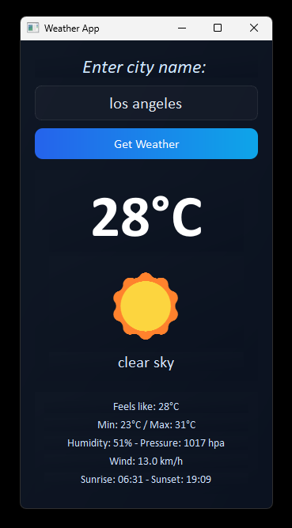
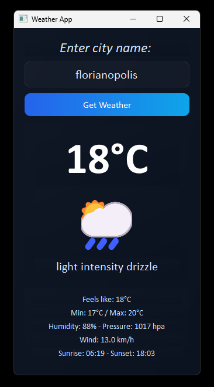

# Weather App 🌦️

A desktop application in Python using PyQt5 that shows the weather forecast for any city in the world using the OpenWeather public API.

---

##  Features

- Search the weather for any city in the world
  
- Display:

  - Current tempetarure in Celsius;
  - Feels like temperature;
  - Min/Max temperature;
  - Humidity and pressure;
  - Wind speed;
  - Sunrise and sunset in the local time

- Detailed error handling

- Modern layout wity styled fonts

---

##  Installation

1. Clone this repository and navigate into it:

```bash
git clone https://github.com/Alan-Lima97/WeatherApp.git
cd WeatherApp
```

2. Create a virtual environment (optional but recommended):

```bash
python -m venv .venv
source .venv/bin/activate    # Linux / Mac
.venv\Scripts\activate       # Windows
```

3. Install dependencies
	- pip install -r requirements.txt

4. Get your OpenWeather API key and replace it in ui.py (inside method get_weather)
	- api_key = "YOUR KEY"

## Usage

Run the application
	- python main.py

- Enter the city name and click in the Get Weather button

- The app will display all weather information for the selected city

## Screenshots




